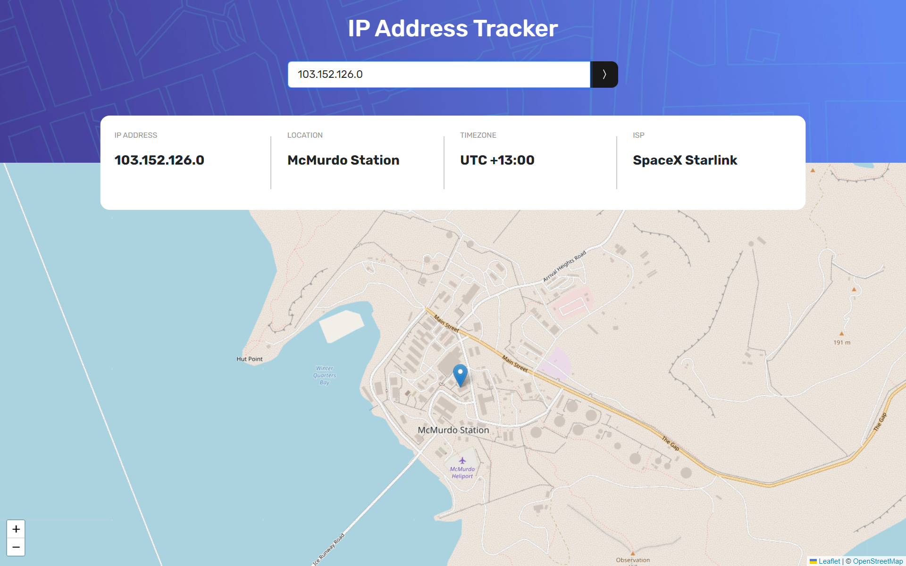

# IP Address Tracker

Live: https://ahmedhanye.github.io/ip-address-tracker/

## Description

The IP Address Tracker is a web application built with React and Bootstrap that allows users to input an IP address and view its associated location on a map. The application utilizes the Leaflet library for map rendering and the Ipify API for IP address geolocation.

## Features

- Input field to enter an IP address.
- Display of the location corresponding to the entered IP address on the map.
- Additional information such as IP address, location coordinates.

## Technologies Used

- React
- Bootstrap
- Leaflet
- Ipify API

## Usage

1. Enter an IP address into the input field.
2. Press the "Track" button to view the location associated with the entered IP address on the map.

##

Feel free to customize this README.md file according to your project's specific details and requirements. If you have any questions or need further assistance, don't hesitate to ask!
